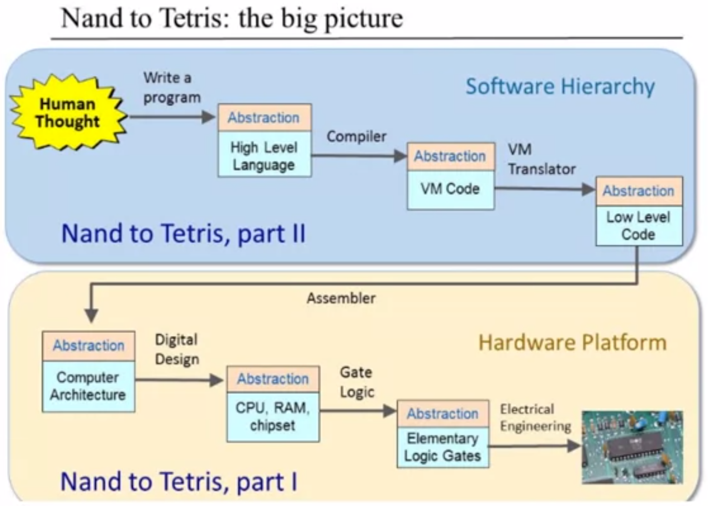

# nand2tetris
Projects, nand2teris, the elements of Compute Systems, done myself

Website: nand2tetris.org

Project01

Building elementry logic gates from the primitive NAND Gate.

Project02

Building ALU from logic gates, built on Project01.

Project03

Building RAM based on DataFlipFlop and logic gates.

Project04

Hack Machine Language programming.

Project05

Built RAM and CPU, and then assemble them wit ROM together to build a computer.

Project06

Built the Hack Assembler, translating Hack Assembly Code into Hack Machine Code.

